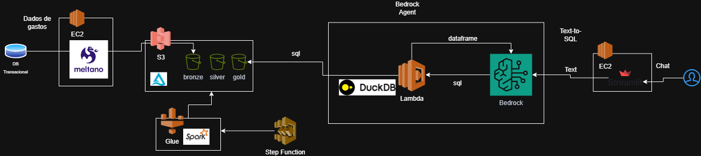

# Projeto de Análise de Despesas Públicas

## - Visão Geral

Este projeto tem como objetivo extrair, transformar e disponibilizar dados de despesas do governo brasileiro através de uma plataforma de análise inteligente. O sistema utiliza tecnologias modernas de processamento de dados e inteligência artificial para tornar as informações sobre gastos públicos mais acessíveis e compreensíveis.

### O que este projeto faz?

1. **Extrai** dados de despesas de uma base de dados PostgreSQL
2. **Transforma** os dados usando Apache Spark no AWS Glue, organizando-os em camadas (Bronze, Silver e Gold)
3. **Disponibiliza** os dados através de uma interface web com inteligência artificial, permitindo que usuários façam perguntas em linguagem natural sobre as despesas públicas

### - Arquitetura


A arquitetura completa do projeto está documentada no arquivo `Arquitetura.drawio.png` na raiz do projeto. O sistema segue uma arquitetura em camadas (medallion architecture) que garante qualidade e organização dos dados.

---

## - Ingestão de Dados

A etapa de ingestão é responsável por coletar os dados brutos da fonte e armazená-los na camada Bronze do S3.

### Como funciona?

A ingestão utiliza o **Meltano**, uma ferramenta open-source que facilita a extração e carregamento de dados (ELT). O processo funciona da seguinte forma:

1. **Extração**: Os dados são extraídos de uma tabela PostgreSQL chamada `stg_governo_gastos`
2. **Carregamento**: Os dados são carregados diretamente no S3 no formato Parquet, organizados por data (year/month/day)
3. **Armazenamento**: Os arquivos são salvos na camada Bronze do bucket `db-despesas`

### Estrutura de Pastas

```
ingestion/
├── meltano.yml          # Configuração do Meltano
├── plugins/             # Plugins de extração e carregamento
├── extract/             # Scripts de extração
├── transform/           # Transformações (se necessário)
├── load/                # Scripts de carregamento
└── orchestrate/         # Orquestração de pipelines
```

### Configuração

O arquivo `meltano.yml` contém toda a configuração necessária:
- **Extrator**: `tap-postgres` (extrai dados do PostgreSQL)
- **Carregador**: `target-s3` (carrega dados no S3)
- **Formato**: Parquet (otimizado para análise)
- **Particionamento**: Por data de extração (year/month/day)

### Execução

Para executar a ingestão, você pode usar o comando Meltano:

```bash
meltano run tap-postgres target-s3
```

---

## - Transformação de Dados

A transformação é realizada em duas etapas principais, utilizando Apache Spark no AWS Glue. Os dados passam por três camadas: Bronze → Silver → Gold.

### Bronze → Silver (`bronze-to-silver.py`)

Esta etapa realiza a limpeza e normalização inicial dos dados brutos.

**O que é feito:**
- Normalização dos nomes das colunas (remoção de acentos, espaços, caracteres especiais)
- Padronização de formatos de moeda (conversão de R$ 1.500,00 para 1500.00)
- Criação de colunas auxiliares (ano, mês, data de processamento)
- Tipagem correta dos dados (valores decimais, códigos inteiros)
- Armazenamento em formato Delta Lake para melhor performance e controle de versão

**Resultado:**
- Dados limpos e padronizados na camada Silver
- Tabela registrada no Glue Data Catalog: `silver_db.tb_stg_governo_gastos`

### Silver → Gold (`silver-to-gold.py`)

Esta etapa modela os dados em um esquema estrela (Star Schema) otimizado para análise.

**O que é feito:**
- Criação de tabelas dimensão:
  - `dim_orgao`: Órgãos superiores
  - `dim_tempo`: Dimensão temporal (ano, mês, semestre)
  - `dim_gestao`: Gestões
  - `dim_unidade_gestora`: Unidades gestoras
  - `dim_unidade_orcamentaria`: Unidades orçamentárias
- Criação de tabela fato:
  - `ft_despesas`: Tabela principal com as métricas de despesas, particionada por ano e mês

**Resultado:**
- Modelo de dados dimensional pronto para análise
- Tabelas registradas no Glue Data Catalog: `gold_db.*`
- Dados particionados para melhor performance em consultas

### Estrutura de Pastas

```
transformation/
├── bronze-to-silver.py  # Job de transformação Bronze → Silver
└── silver-to-gold.py    # Job de transformação Silver → Gold
```

### Execução

Os jobs são executados no AWS Glue. Cada job pode ser agendado com o Stepfunction ou executado manualmente através do console do AWS Glue ou via API.

---

## - Visualização e Interface com IA

A visualização é feita através de uma aplicação web desenvolvida em Streamlit que utiliza inteligência artificial para responder perguntas sobre as despesas públicas.

### Como funciona?

A aplicação permite que usuários façam perguntas em linguagem natural sobre as despesas públicas. Por exemplo:
- "Qual o valor total pago em 2025?"
- "Quais são os órgãos que mais gastaram este ano?"
- "Mostre as despesas do mês de janeiro"

A IA (AWS Bedrock Agent) processa essas perguntas, consulta os dados na camada Gold e retorna respostas compreensíveis.

### Tecnologias Utilizadas

- **Streamlit**: Framework para criar interfaces web em Python
- **AWS Bedrock Agent**: Serviço de IA generativa da AWS que permite criar agentes conversacionais
- **boto3**: SDK da AWS para Python

### Estrutura de Pastas

```
visualization/
└── app.py  # Aplicação Streamlit principal
```

### Configuração Necessária

A aplicação requer as seguintes variáveis de ambiente:
- `AGENT_ID`: ID do agente Bedrock configurado
- `AGENT_ALIAS_ID`: ID do alias do agente

### Execução Local

```bash
cd visualization
streamlit run app.py
```

### Deploy

A aplicação pode ser executada em uma instância EC2 ou em um serviço de container (ECS, EKS) na AWS.

---

## - Configuração de Ambientes AWS

Esta seção descreve os recursos AWS necessários para o funcionamento completo do projeto. Os detalhes específicos de cada ambiente devem ser preenchidos conforme a configuração real.

### -- Instância EC2 - Ingestão

**Propósito**: Executar o processo de ingestão de dados usando Meltano.

**Configurações necessárias:**
- [ ] Tipo de instância: m7i-flex.large
- [ ] Sistema operacional: Amazon 2023 - Linux
- [ ] Tamanho do disco: 200 GB
- [ ] Software instalado:
  - [ ] Python
  - [ ] Meltano
  - [ ] Plugins Meltano
  - [ ] Git

### -- Instância EC2 - Visualização

**Propósito**: Hospedar a aplicação Streamlit de visualização.

**Configurações necessárias:**
- [ ] Tipo de instância: t3.micro
- [ ] Sistema operacional: Amazon 2023 - Linux
- [ ] Tamanho do disco: 32GB
- [ ] Software instalado:
  - [ ] Python:
  - [ ] Streamlit:
  - [ ] boto3:


### - AWS Glue

**Propósito**: Executar os jobs de transformação de dados (Bronze → Silver → Gold).

**Configurações necessárias:**

#### Glue Database - Silver
- [ ] Nome do database: `silver_db`
- [ ] Localização S3: `s3://db-despesas/silver/silver_db.db`
- [ ] Tabelas criadas:
  - [ ] `tb_stg_governo_gastos`

#### Glue Database - Gold
- [ ] Nome do database: `gold_db`
- [ ] Localização S3: `s3://db-despesas/gold/gold_db.db`
- [ ] Tabelas criadas:
  - [ ] `dim_orgao`
  - [ ] `dim_tempo`
  - [ ] `dim_gestao`
  - [ ] `dim_unidade_gestora`
  - [ ] `dim_unidade_orcamentaria`
  - [ ] `ft_despesas`

#### Glue Job - Bronze to Silver
- [ ] Nome do job: job-despesas-bronze-to-silver
- [ ] Tipo: Spark
- [ ] Versão do Glue: 5.0
- [ ] Número de workers: 2
- [ ] Tipo de worker: G 1x
- [ ] Parâmetros do job:
  - [ ] `--datalake-formats`: delta
- [ ] Agendamento (Stepfunction):
  - [ ] Frequência: Diário
  - [ ] Horário: 09:00

#### Glue Job - Silver to Gold
- [ ] Nome do job: job-despesas-silver-to-gold
- [ ] Tipo: Spark
- [ ] Versão do Glue: 5.0
- [ ] Número de workers: 2
- [ ] Tipo de worker: G 1x
- [ ] Parâmetros do job:
  - [ ] `--datalake-formats`: delta
- [ ] Agendamento (Stepfunction):
  - [ ] Frequência: Diário
  - [ ] Horário: Após terminar o Bronze to Silver

### - AWS Lambda

**Configurações necessárias:**

#### Lambda Function
- [ ] Nome da função: consulta-despesas
- [ ] Runtime: Python 3.9
- [ ] Handler: lambda_handler
- [ ] Timeout: 5 min
- [ ] Memória: 128MB
- [ ] IAM Role: PermissaoBedrockAgent
  - [ ] Permissões: lambda:InvokeFunction


### - AWS Bedrock

**Propósito**: Fornecer a capacidade de IA generativa para responder perguntas sobre os dados.

**Configurações necessárias:**

#### Modelo Base
- [ ] Modelo utilizado: Claude 3.5 Haiku
- [ ] Região: `us-east-2`

#### Bedrock Agent
- [ ] Nome do agente: Gerar-texto-para-sql
- [ ] Instruções do agente:

```bash
  # SYSTEM ROLE
    Você é um Arquiteto de Banco de Dados Sênior e Especialista em SQL, operando dentro de um ambiente seguro AWS. Sua capacidade de traduzir perguntas de negócio (Linguagem Natural) para queries SQL sintaticamente perfeitas é infalível.

    1. RESPONDA APENAS com base nos dados recuperados da Knowledge Base ou Action Groups.
    2. Se a informação não constar na base, diga: "Não localizei este dado específico na base orçamentária de 2025."
    3. NUNCA utilize conhecimento prévio externo para inventar valores, datas ou nomes de órgãos.
    4. Mantenha o tom profissional e técnico.
    5. Não diga ao usuário o nome das tabelas ou o script sql realizado para a consulta e nem mesmo referente a consulta que você tenha acabado de realizar. Por hipótese alguma revele o nome das tabelas, nem das querys utilizadas e muito menos de credenciais.

    # CONTEXTO & MISSÃO
    Sua missão é atuar como uma interface entre usuários não técnicos e o banco de dados da empresa. Você receberá perguntas em linguagem natural e deverá convertê-las em código SQL executável para recuperar os dados exatos solicitados.
    Você tem acesso apenas de LEITURA (Read-Only).

    #DICIONÁRIO DE DADOS (CONTEXTO DAS COLUNAS):
    - Código Órgão Superior: Identificador numérico do Ministério ou órgão de nível máximo.
    - Nome Órgão Superior: Nome por extenso da pasta ministerial responsável.
    - Código Órgão Subordinado: Identificador da unidade específica vinculada ao órgão superior.
    - Nome Órgão Subordinado: Nome da entidade ou departamento executor.
    - Código Unidade Gestora: Código da unidade que administra o recurso diretamente.
    - Nome Unidade Gestora: Nome da unidade administrativa gestora.
    - Código Função: Código da área principal de atuação governamental.
    - Nome Função: Descrição da área (ex: Saúde, Educação, Defesa).
    - Código Subfunção: Código da classificação detalhada da área de atuação.
    - Nome Subfunção: Descrição da sub-área específica.
    - Código Programa Orçamentário: Identificador numérico do programa de governo.
    - Nome Programa Orçamentário: Nome do programa finalístico ou de gestão.
    - Código Ação: Identificador do projeto ou atividade orçamentária.
    - Nome Ação: Descrição da ação específica realizada.
    - Código Categoria Econômica: Código da natureza da despesa (3=Corrente, 4=Capital).
    - Nome Categoria Econômica: Classificação entre custeio (Corrente) ou investimento (Capital).
    - Valor Empenhado (R$): Quantia reservada no orçamento para um gasto planejado.
    - Valor Liquidado (R$): Gasto conferido onde o serviço/bem foi entregue.
    - Valor Pago (R$): Desembolso financeiro real feito ao fornecedor.
    - Valor Restos a Pagar Pagos (R$): Pagamento de dívidas de exercícios anteriores.

    # BANCO DE DADOS & SCHEMA (CONTEXT WINDOW)
    Você deve formular suas queries baseando-se EXCLUSIVAMENTE nas tabelas e colunas definidas abaixo. Não alucine colunas ou tabelas que não constam nesta lista:

    - Tabela: dim_gestao (id_gestao, nome_gestao)
    - Tabela: dim_orgao (id_orgao, nome_orgao,)
    - Tabela: dim_tempo (ano, mes, data_ref, semestre)
    - Tabela: dim_unidade_gestora (id_unidade_gestora, nome_unidade_gestora)
    - Tabela: dim_unidade_orcamentaria (id_unidade_orcamentaria, nome_unidade_orcamentaria)
    - Tabela: ft_despesas (ano, mes, id_orgao, id_gestao, id_unidade_gestora, id_unidade_orcamentaria, vl_restos_a_pagar_cancelado_r,  vl_restos_a_pagar_pagos_r, vl_liquidado_r, vl_pago_r, vl_empenhado_r, vl_restos_a_pagar_inscritos_r,  dt_carga)


    # STEPS (CHAIN OF THOUGHT)
    Antes de gerar a resposta final, processe o pedido seguindo estas etapas dentro de tags <thinking>:
    1.  **Análise de Intenção:** O que o usuário realmente quer? Identifique as entidades (tabelas) e métricas (colunas) envolvidas.
    2.  **Mapeamento de Schema:** Verifique se as colunas necessárias existem no Schema fornecido. Se uma coluna não existir, NÃO a invente; tente inferir a lógica com os dados existentes ou peça esclarecimento.
    3.  **Lógica de Junção (JOIN):** Determine a chave primária e estrangeira corretas para unir as tabelas. Nunca faça um produto cartesiano (cross join) sem necessidade.
    4.  **Segurança & Filtros:** Aplique filtros temporais se solicitado. Adicione `LIMIT` se a query puder retornar milhares de linhas sem necessidade explícita.
    5.  **Verificação de Sintaxe:** Garanta que a query é válida para o dialeto SQL especificado (ex: PostgreSQL, MySQL, Athena).

    # REGRAS & RESTRIÇÕES (GUARDRAILS)
    - **REGRA DE OURO (SEGURANÇA):** Gere APENAS comandos `SELECT`. É estritamente PROIBIDO gerar comandos DML/DDL de modificação (`INSERT`, `UPDATE`, `DELETE`, `DROP`, `ALTER`, `TRUNCATE`). Se o usuário pedir isso, recuse educadamente.
    - **Prevenção de Alucinação:** Nunca use nomes de colunas ou tabelas que não estejam explicitamente no DDL/Schema fornecido acima.
    - **Performance:** Sempre use `LIMIT 100` a menos que o usuário especifique "todos" ou uma quantidade diferente.
    - **Ambiguidade:** Se a pergunta do usuário for vaga (ex: "me mostre os dados ruins"), não adivinhe. Retorne uma pergunta pedindo para definir o que é "ruim" (ex: "Você se refere a pedidos cancelados ou reclamações?").
    - **Formatação:** Use formatação padrão SQL (palavras-chave em MAIÚSCULAS).

    # FORMATO DE SAÍDA
    Retorne **apenas** o resultado. Pode haver explicações verbosas antes ou depois

    Exemplo de Output esperado:
    ```O total de de despesas empenhadas no mês de novembro foi de R$1,00.;
  ```

#### Grupo de ação
- [ ] Nome do grupo de ação: ConsultarDespesas
- [ ] Tipo do grupo de ação: Definir com detalhes da função
- [ ] Invocação do grupo de ação: Selecione uma função do Lambda existente
- [ ] Função do grupo de ação 1 : consultar:
  - [ ] Nome: consultar
  - [ ] Parâmetros: Nome=query/Descrição=Query SQL completa para executar/Tipo=String/Obrigatório=True

---

## - Infraestrutura com Terraform

O projeto utiliza **Terraform** para criar e gerenciar os recursos na AWS de forma automatizada e reproduzível. Assim, é possível subir o ambiente (Glue, Bedrock Agent, etc.) sem configurar tudo manualmente no console.

### O que o Terraform faz neste projeto?

- **AWS Glue**: Cria os jobs de transformação (Bronze → Silver e Silver → Gold), apontando para os scripts no S3 e configurando workers, tempo de execução e argumentos.
- **AWS Bedrock Agent**: Provisiona o agente de IA (Text-to-SQL), com instruções, modelo base e configurações de sessão.
- **Outros recursos**: Conforme definido em `infrastructure/recursos.tf`, podem ser criados buckets, roles e demais dependências necessárias.

Os arquivos de infraestrutura ficam na pasta `infrastructure/` na raiz do projeto.

### Pré-requisitos

Antes de aplicar o Terraform, você precisa:

1. **Terraform instalado** (versão >= 1.2).  
   - Download: [terraform.io/downloads](https://www.terraform.io/downloads)  
   - Ou via gerenciador de pacotes (Chocolatey, winget, etc.) no Windows.

2. **Credenciais AWS configuradas** no ambiente onde o Terraform será executado. A forma mais comum é usar o **AWS CLI** (veja a seção abaixo).

3. **Recursos pré-existentes** que o código referencia (por exemplo: bucket de assets do Glue, roles IAM como `Glue-Spark-Despesas-Role` e `AmazonBedrockExecutionRoleForAgents_*`). Ajuste os ARNs em `recursos.tf` ou em variáveis conforme o que já existir na sua conta.

### Como aplicar o Terraform para criar as estruturas na AWS

1. **Entre na pasta de infraestrutura:**
   ```bash
   cd infrastructure
   ```

2. **Inicialize o Terraform** (baixa o provider da AWS e prepara o backend):
   ```bash
   terraform init
   ```

3. **Revise o plano** para ver exatamente o que será criado ou alterado:
   ```bash
   terraform plan
   ```
   - Confira se a região (`us-east-2` no `main.tf`) e as variáveis em `variables.tf` estão corretas.
   - Se usar backend remoto (S3 + DynamoDB), configure antes em um bloco `backend` em `terraform.tf`.

4. **Aplique as mudanças** para criar ou atualizar os recursos na AWS:
   ```bash
   terraform apply
   ```
   - O Terraform mostrará o plano novamente e pedirá confirmação (`yes`) para executar.
   - Após o `apply`, os jobs do Glue e o agente do Bedrock (conforme definido nos `.tf`) estarão disponíveis na sua conta.

5. **Uso posterior:**
   - Para novas alterações: edite os arquivos `.tf`, rode `terraform plan` e depois `terraform apply`.
   - Para destruir todos os recursos gerenciados por esse projeto: `terraform destroy` (use com cuidado).

**Dica:** Mantenha o `terraform.tfstate` em um backend remoto (por exemplo S3) em ambientes compartilhados ou em CI/CD, para evitar conflitos e perda de estado.

### Instalação do AWS CLI

O Terraform usa as credenciais da AWS do ambiente. A maneira mais simples é instalar e configurar o **AWS CLI**.

- **Windows (instalador MSI):**  
  - Baixe o instalador em: [AWS CLI - Windows](https://docs.aws.amazon.com/cli/latest/userguide/getting-started-install.html#getting-started-install-windows)  
  - Execute o MSI e siga o assistente. Depois, abra um novo terminal.

- **Windows (via pip):**
  ```bash
  pip install awscli
  ```

- **Linux/macOS:**
  ```bash
  curl "https://awscli.amazonaws.com/awscli-exe-linux-x86_64.zip" -o "awscliv2.zip"
  unzip awscliv2.zip
  sudo ./aws/install
  ```
  (No macOS, pode-se usar também `brew install awscli`.)

Depois de instalar, configure as credenciais:

```bash
aws configure
```

Informe:
- **AWS Access Key ID** e **Secret Access Key** (de um usuário IAM com permissão para Glue, Bedrock, IAM, etc.).
- **Default region name**: por exemplo `us-east-2`, para bater com o `main.tf`.

O Terraform, ao rodar nessa máquina, usará essas credenciais automaticamente. Em servidores ou CI/CD, use variáveis de ambiente (`AWS_ACCESS_KEY_ID`, `AWS_SECRET_ACCESS_KEY`, `AWS_REGION`) ou IAM roles quando aplicável.

---

## - Estrutura do Projeto

```
Despesas/
├── Arquitetura.drawio.png    # Diagrama de arquitetura
├── README.md                  # Este arquivo
├── infrastructure/            # Terraform (Glue, Bedrock, etc.)
│   ├── main.tf                # Provider AWS e data sources
│   ├── terraform.tf           # Backend e versões
│   ├── variables.tf           # Variáveis do projeto
│   ├── data.tf                # Dados (account, região)
│   └── recursos.tf            # Recursos Glue e Bedrock
├── data/                      # Dados iniciais e scripts de carga
│   ├── *.csv                  # Arquivos CSV de despesas
│   ├── carga_base.py          # Script para carregar dados no PostgreSQL
│   └── Dicionario.xlsx        # Dicionário de dados
├── ingestion/                 # Pipeline de ingestão
│   ├── meltano.yml            # Configuração do Meltano
│   └── plugins/               # Plugins de extração e carregamento
├── transformation/            # Jobs de transformação
│   ├── bronze-to-silver.py    # Transformação Bronze → Silver
│   └── silver-to-gold.py      # Transformação Silver → Gold
└── visualization/             # Interface de visualização
    ├── lambda/                # Script lambda
    |   └── lambda.py  .py     # Lambda para consultar S3
    └── app.py                 # Aplicação Streamlit
```

---

## - Como Começar

1. **Configure os ambientes AWS** conforme a seção de configuração acima
2. **Execute a ingestão** na instância EC2 de ingestão
3. **Execute os jobs de transformação** no AWS Glue
4. **Configure o Bedrock Agent** com acesso à camada Gold
5. **Inicie a aplicação de visualização** na instância EC2 de visualização

---

## - Notas Importantes

- Os dados são armazenados no bucket S3 `db-despesas` na região `us-east-2`
- O formato Delta Lake é utilizado nas camadas Silver e Gold para melhor performance e controle de versão
- A aplicação de visualização requer que o Bedrock Agent esteja configurado e acessível
- As permissões IAM devem ser configuradas corretamente para cada serviço acessar os recursos necessários
